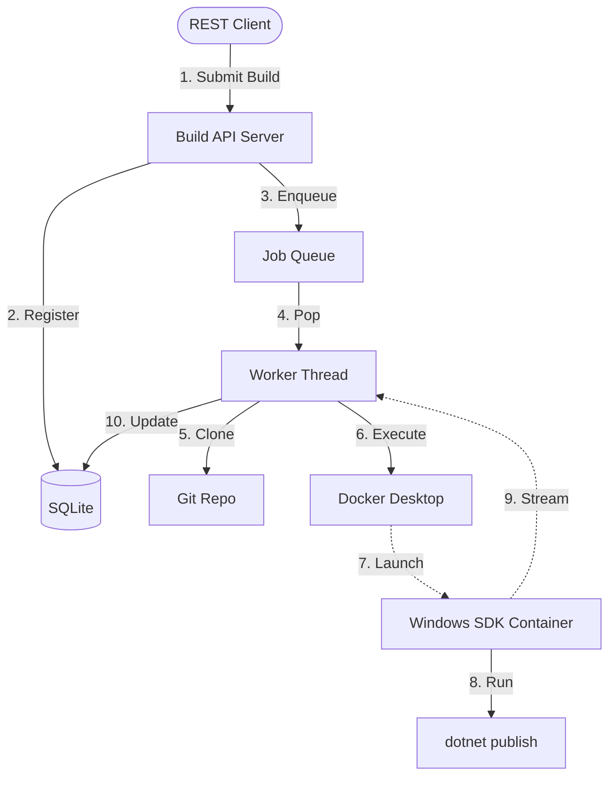

# 🚀 WinBuild Cloud: Local Windows Build Platform

> **A Production-Grade Local Cloud Build System for Windows Containers**

[](LICENSE)
[](mailto:shitalbabasopatil@gmail.com)
[](https://docs.microsoft.com/en-us/virtualization/windowscontainers/)

WinBuild Cloud is a high-performance build orchestration system engineered for **Windows-native CI/CD workflows**. It enables seamless building of .NET applications in isolated, Hyper-V protected Windows Server Core environments.

---

## 📖 Essential Documentation
- **[Detailed Case Study](CASE_STUDY.md)**: Engineering challenges, architectural decisions, and impact analysis.
- **[Full Architecture Diagram](architecture.mmd)**: Comprehensive Mermaid visualization of the system components.
- **[License](LICENSE)**: Apache 2.0 - Licensed for professional and commercial use.

---

## 🏗 System Architecture

The platform uses a decoupled **Producer-Consumer** architecture to ensure high availability and responsiveness.

### Core Components
- **API Gateway (FastAPI)**: Handles REST requests, validates payloads, and manages the SQLite build registry.
- **Async Queue Manager**: An in-memory orchestration layer that manages job priorities and distribution.
- **Windows Executor (docker-py)**: The heavy-lifter that communicates with the Docker Engine to spin up isolated Windows Server Core containers.
- **Log Streamer**: Captures and persists real-time `stdout/stderr` from the containerized MSBuild processes.

### High-Level Design


---

## 🛠 Prerequisites & Local Setup

To run this system, your machine must meet the following requirements for Windows Container isolation.

### 1. Windows Features
Ensure the following features are enabled in **Turn Windows features on or off**:
- [x] Containers
- [x] Hyper-V
- [x] Virtual Machine Platform

### 2. Docker Desktop Configuration
- **Mode**: You MUST switch Docker Desktop to **Windows Containers** mode.
- **Resources**: Minimum 4GB RAM and 2 CPUs recommended.
- **Disk Space**: Windows Server Core images are large (~3-5GB). Ensure you have sufficient space.

### 3. Repository Setup
```powershell
# Clone the build system
git clone <this-repo-url>
cd mini-windows-build-system
```

---

## 🚀 Running the Platform

Launch the entire stack with a single command:

```powershell
docker-compose up --build
```

> [!NOTE]
> The first run will take several minutes as it pulls the `mcr.microsoft.com/dotnet/sdk:8.0-windowsservercore-ltsc2022` image.

---

## 📡 API Reference

### Submit a Build Job
`POST /build`

**Request Body:**
```json
{
  "repo_url": "https://github.com/dotnet/dotnet-docker",
  "branch": "main",
  "project_path": "./samples/dotnetapp/dotnetapp.csproj",
  "build_command": "dotnet publish -c Release -o out"
}
```

**Example Curl:**
```bash
curl -X POST "http://localhost:8000/build" \
     -H "Content-Type: application/json" \
     -d "{\"repo_url\": \"https://github.com/sample/app\", \"project_path\": \"src/App.csproj\"}"
```

### Track Build Status
`GET /build/{id}`

**States:** `QUEUED` ➔ `CLONING` ➔ `RUNNING` ➔ `SUCCESS` | `FAILED`

### Fetch Real-Time Logs
`GET /build/{id}/logs`

---

## 🧪 Testing with the Sample App

We have included a pre-configured .NET 8 sample application and a test script to demonstrate the full lifecycle.

1.  Ensure the build server is running (`docker-compose up`).
2.  Execute the test automation:
    ```powershell
    .\scripts\test_build.ps1
    ```
    This script will:
    - Point the system to the local `sample_app` directory.
    - Submit the build request via REST.
    - Poll the log endpoint and stream output to your console.

---

## 🔍 Build Lifecycle Details

1.  **Request Validation**: API checks the Git URL and project structure.
2.  **Workspace Isolation**: A unique GUID directory is created in `./storage/builds/`.
3.  **Git Ingest**: Repository is cloned into the isolated workspace.
4.  **Container Spin-up**: A Windows Server Core container is launched with the workspace mounted as `C:\build`.
5.  **PowerShell Execution**:
    ```powershell
    cd C:\build\<project_path>
    dotnet restore
    dotnet build
    dotnet publish -c Release -o out
    ```
6.  **Cleanup**: The temporary container is destroyed, leaving only the artifacts and logs in local storage.

---

## 🔧 Troubleshooting & FAQ

| Issue | Solution |
| :--- | :--- |
| **"Access Denied" to Docker Pipe** | Run PowerShell as Administrator. Docker named pipes require elevated privileges. |
| **"Invalid Platform" Error** | You are likely in Linux Container mode. Right-click Docker tray icon -> **Switch to Windows containers**. |
| **Build Timeout** | Windows containers take longer to start than Linux. Ensure your disk is SSD-based for better I/O. |
| **Git Clone Failure** | Ensure the `build-server` container has internet access or the `repo_url` is accessible from within the nat network. |

---

## 🛡 Security & Best Practices
- **Process Isolation**: Uses Hyper-V isolation by default on Windows 11.
- **Resource Constraints**: Each container is scoped to its mount point.
- **Sanitization**: PowerShell commands are wrapped in strict string literals to prevent injection.

---

## 📈 Roadmap & Optimization
- [ ] **NanoServer Support**: Optimization for smaller footprints.
- [ ] **Parallel Workers**: Support for multiple concurrent build agents.
- [ ] **Artifact Archiving**: Auto-zipping of `out/` directories.
- [ ] **Web UI**: Dashboard for visual build management.

---
## 👤 Maintainer

**Shital Babaso Patil**
- **Email**: [shitalbabasopatil@gmail.com](mailto:shitalbabasopatil@gmail.com)
- **Focus**: Native Windows Automation, DevOps Architecture, and Container Security.

---
**Developed with ❤️ for the Windows Developer Community.**
